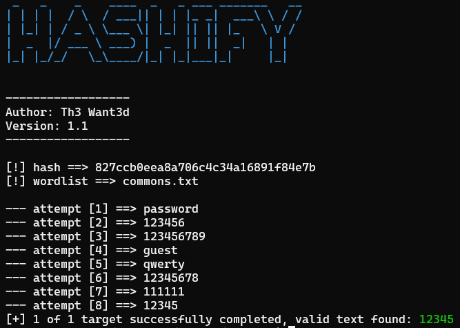

# Hashify

Now in your new version, its possible generate hash and crack a hash if you want.



# Install
```bash
git clone https://github.com/jadielsanttos/hashify.git
cd hashify
```
# Usage 

## # Hash generate
```bash
python app.py -G 12345
``` 
## # Hash cracking
```bash
python app.py -H 827ccb0eea8a706c4c34a16891f84e7b -W wordlist.txt
```