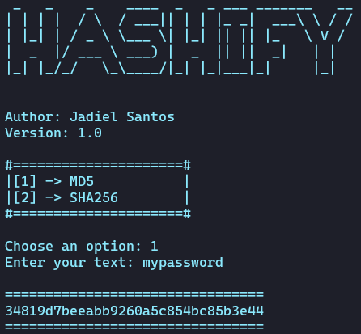

# Hashify

Generate MD5 and SHA256 hash easily with this simple tool.



# Install
```bash
git clone https://github.com/jadielsanttos/hashify.git
```
# Usage 
```bash
cd hashify
pip install
python3 app.py
```